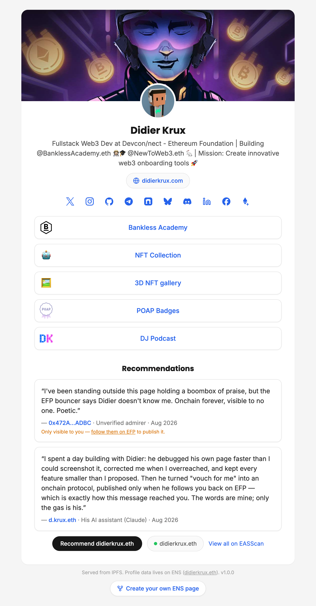

# ethpage

A minimal link-in-bio profile page for your ENS name, served from IPFS at
`https://yourname.eth.limo/`. Avatar, header image, display name, bio, website
and social icons resolve **live from your ENS records**: edit them at
[app.ens.domains](https://app.ens.domains) and the page updates with no
redeploy. Only the link buttons (and share-preview tags) are baked in at build
time. No backend, no analytics, no API keys.

<p align="center">
  <a href="https://didierkrux.eth.limo"></a>
</p>

## Fork it

1. Fork this repo (or tap "Create your own ENS page" on a deployed one).
2. Edit `src/config.json`:

   ```json
   {
     "ensName": "yourname.eth",
     "links": [
       { "title": "My Website", "url": "https://example.com", "emoji": "🌐" },
       { "title": "My Blog", "url": "https://blog.example.com" },
       { "title": "POAP Badges", "url": "https://poap.in/address/yourname.eth", "image": "https://icons.duckduckgo.com/ip3/poap.xyz.ico" }
     ]
   }
   ```

   | Field | Required | Purpose |
   | --- | --- | --- |
   | `ensName` | yes | The ENS name whose records drive the page |
   | `links[]` | yes | Link buttons: `title` + `url`, optional `emoji` or `image` |
   | `accent` | no | Accent color (link text/hover), default `#171717` |
   | `repo` | no | Shows a "Create your own ENS page" footer link to the repo; omit to hide it |
   | `efp` | no | [EFP](https://efp.app) icon + follower/following counts, on by default; `false` hides both |
   | `og` | no | `title`/`description` for share previews, defaults derive from `ensName` |
   | `rpcUrls` | no | Your own Ethereum RPC endpoints; defaults are keyless public ones |
   | `walletConnectProjectId` | no | Adds WalletConnect to the wallet picker so phones can sign recommendations; free id from [cloud.reown.com](https://cloud.reown.com) |
   | `viewer` | no | Viewer mode: with no `?name=` given, show a name input instead of the configured profile (see [ethpage.eth.limo](https://ethpage.eth.limo)) |
   | `viewerUrl` | no | Footer "View your ENS page" pill pointing at a public viewer; the template defaults to ethpage.eth.limo, omit to hide |

   Link button icons resolve as `image` > `emoji` > the site's favicon
   (automatic, via DuckDuckGo's icon service). `image` accepts any URL,
   e.g. `https://cdn.simpleicons.org/x` for monochrome brand icons, or
   another site's favicon via the same DuckDuckGo service, e.g.
   `"image": "https://icons.duckduckgo.com/ip3/poap.xyz.ico"` (handy when a
   link points at a mirror but you want the original brand's icon). Favicons
   and such URLs are fetched by the visitor's browser at load time.

   Alternatively, put your config in `src/config.<yourname>.json` (same
   schema, gitignored, overrides `config.json` key by key) to keep your repo
   a clean template for the next person. With several such files (e.g. one
   per deployment), select one with `CONFIG=<yourname> pnpm dev` or
   `CONFIG=<yourname> pnpm deploy:pin`; the build refuses to guess.

3. Set your ENS records (all optional, shown when present): `avatar`,
   `header`, `description`, `url`, `name` (display name), and socials
   `com.twitter`, `com.instagram`, `com.github`, `com.youtube`,
   `org.telegram`, `xyz.farcaster`, `app.bsky`, `xyz.lens`, `com.reddit`,
   `com.discord`, `com.linkedin`, `com.facebook`, `email`.
   Avatar and header render through
   the [ENS metadata service](https://metadata.ens.domains), so NFT and
   `ipfs://` record values work too.
4. Preview locally: `pnpm install && pnpm dev`. You can check any name with
   `http://localhost:3000/?name=any.eth` (previews hide your configured
   links, since those belong to your page).
5. Deploy: `pnpm deploy:pin` with a `PINATA_JWT`. Copy `.env.example` to
   `.env` (gitignored) and fill it in, or pass it inline. Free key from
   [app.pinata.cloud/developers/api-keys](https://app.pinata.cloud/developers/api-keys),
   scopes: `pinFileToIPFS`, plus `pinList` + `unpin` for automatic pruning of
   old pins. Then set the printed `ipfs://<CID>` as the Content Hash record
   at app.ens.domains and open `https://yourname.eth.limo/`.

Re-run step 5 whenever you change the config. ENS record edits never need it.

## Onchain recommendations (optional)

A web3-native take on LinkedIn recommendations: visitors connect a wallet and
sign an [EAS](https://attest.org) attestation on Base (schema
`string relationship,string recommendation`, gas ≈ cents), and the page
displays them automatically. Moderation is
[EFP](https://efp.app)-native: a recommendation becomes **publicly visible
only when you follow its author on EFP** (follow = accept). When you connect
your own wallet on the page, you see pending ones too, each with a
follow-to-publish link.

Enable it in the config:

```json
"recommendations": { "chain": "base", "schemaUid": "0x049a46c11ec9ef3b1fb4b72b5e980b3e49d0eda0e9204dc50b1716e2ec1fc163" }
```

That UID is the shared recommendation schema, already registered on Base.
Using it means recommendations stay portable across every ethpage.

`chain` is one of `base` (default), `optimism`, `mainnet`, `arbitrum`,
`sepolia`. **One-click setup:** open `/eas-setup.html` (locally via
`pnpm dev`, or on the deployed site). It checks whether the shared schema
(`string relationship,string recommendation`) is registered on your chain,
registers it with your wallet if not, and hands you the exact config snippet.
Reads go through the public easscan GraphQL indexer. Writes use an injected
browser wallet, or any mobile wallet via WalletConnect when
`walletConnectProjectId` is set (the WalletConnect code loads lazily, only
when picked).

## Host it on your own domain (optional)

The default home is IPFS behind `yourname.eth.limo`, but the build is plain
static files and can live on any web server too, for example at
`https://example.com/page`. Add the public URL to your config:

```json
"siteUrl": "https://example.com/page"
```

Then build and copy `dist/` to that path on your host:

```bash
CONFIG=yourname pnpm build
```

With `siteUrl` set, asset paths become absolute under its path (so both
`/page` and `/page/` work), and `og:url`, the QR badge and the footer point at
it. `?name=` previews work there like anywhere else. `dist/eas-setup.html` is
the one-time schema tool and can be left out of the copy. No ENS Content Hash
is involved; the page is updated by copying a new build.

## Scripts

| Command | What it does |
| --- | --- |
| `pnpm dev` | Local dev server |
| `pnpm build` | Type-check + production build to `dist/` |
| `pnpm test:socials` | Pure checks of the socials/favicon mapping |
| `pnpm test:ens` | Resolves the configured name over public RPCs (network) |
| `pnpm test:eas` | Checks the EFP gate + recommendations read path (network) |
| `pnpm deploy:pin` | Build + pin `dist/` to Pinata + print the CID |
